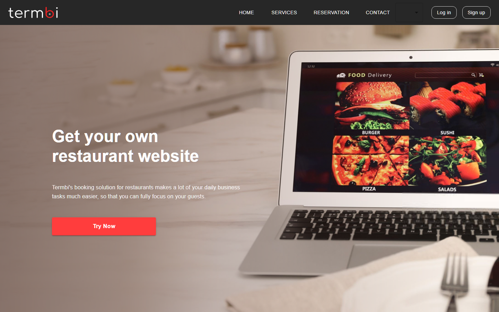

# Termbi

A restaurant marketplace I built as my internship capstone at IXCoders in Damascus (Oct 2025 – Jan 2026). The idea: restaurants get their own store on the platform and sell their products through it, and customers browse, order, and book tables.

**Live demo:** https://termbi-seven.vercel.app



## What it does

- Sign up / login with validated forms and protected routes — restaurants have their own separate auth flow and dashboard pages
- Browse restaurants and their product listings
- Cart and checkout flow
- Table reservations with date pickers
- Live search over the API
- User profile page, plus a contact form with toast feedback

## How it's built

React 19 + Vite, feature-first folders — each domain (`auth`, `cart`, `resturants`, `search`, `profile`, `contact`, `home`) owns its own components, pages, routes, services, and store.

- **Zustand** for client state (cart, user)
- **TanStack React Query + Axios** for server state and caching
- **react-hook-form + Yup** for all the forms
- **MUI** for the UI, including MUI X Date Pickers for the reservation flow
- **react-toastify** for feedback messages

## Run it locally

```bash
yarn install
yarn dev
```

`yarn build` for a production build, `yarn lint` for ESLint.
